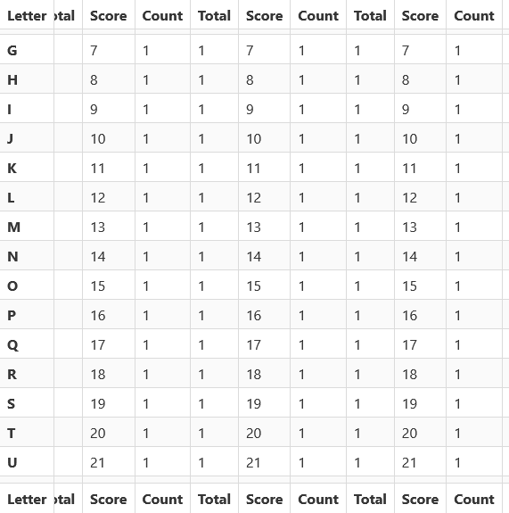

# bulma-sticky-table

[](https://www.npmjs.com/package/@cityssm/bulma-sticky-table)
[](https://app.codacy.com/gh/cityssm/bulma-sticky-table/dashboard)



A Bulma-friendly way to stick a table header, first column, or both!

**[See It In Action](https://cityssm.github.io/bulma-sticky-table)**

## Installation

Download a release, or grab the code from npm.

`npm install @cityssm/bulma-sticky-table`

When building your stylesheet, import `_sticky-table.scss` AFTER you import Bulma.
This will ensure your colour customizations are used.

```scss
@import 'bulma/bulma';
@import '@cityssm/sticky-table/sticky-table';
```

Alternatively, if you are using Bulma without any customizations,
you can replace your Bulma stylesheet with `bulma-with-sticky-tables.min.css`.

```html
<link rel="stylesheet" href="path/to/cityssm/bulma-sticky-table/bulma-with-sticky-table.min.css">
```

## Usage

Build your Bulma table as per usual, using the [Bulma Table Documentation](https://bulma.io/documentation/elements/table/) as your guide.

Then, add either or both of the following classes to your `<table>` tag.

Use `.has-sticky-header` to stick the header.

-   Note that the header should be inside of a `<thead>` tag, and each cell should use a `<th>` tag.

Use `.has-sticky-column` to stick the first column.

-   Note that the first cells in each table row should use the `<th>` tag.

## Thanks

[](https://bulma.io)

Heavily inspired by [code found on CSS-Tricks](https://css-tricks.com/a-table-with-both-a-sticky-header-and-a-sticky-first-column/).
